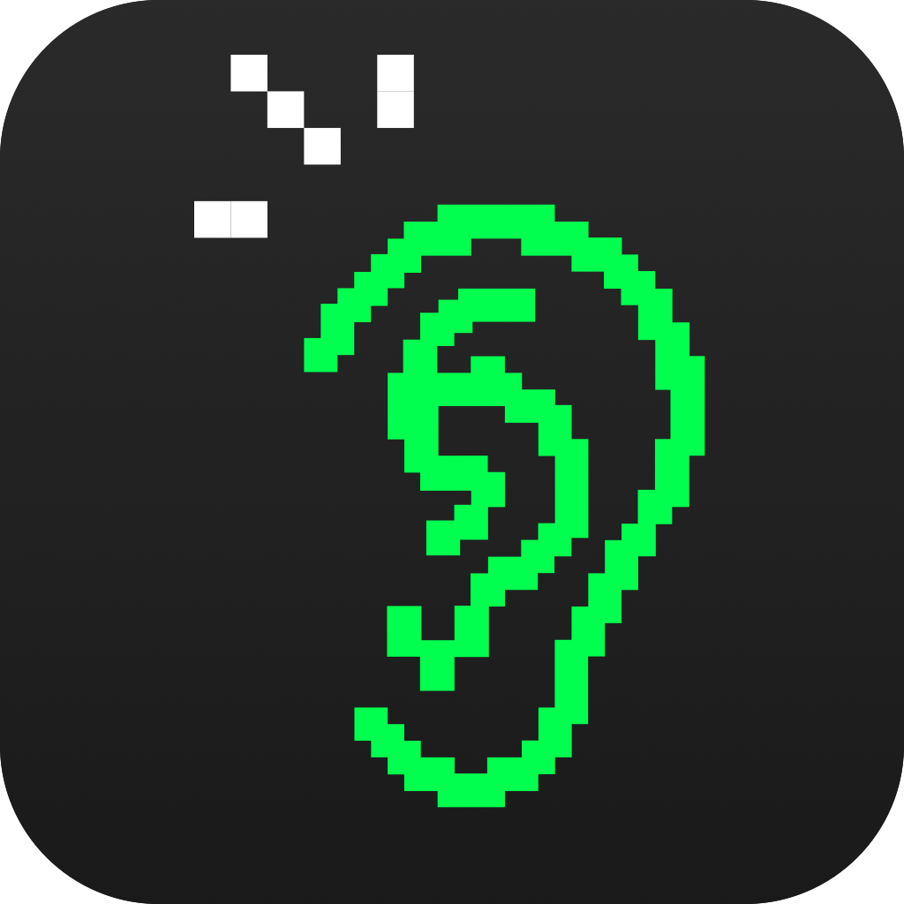

<p align="center">
  
</p>

<h1 align="center">Applause Whisper</h1>

<p align="center">
  Dictate anywhere. Free and local-first.
  <br>
  Speech-to-text powered by <a href="https://github.com/ggerganov/whisper.cpp">whisper.cpp</a> or <a href="https://openai.com/research/whisper">OpenAI Whisper</a>.
</p>

<p align="center">
  <a href="#about">About</a> ·
  <a href="#download">Download</a> ·
  <a href="#features">Features</a> ·
  <a href="#installation">Installation</a> ·
  <a href="#development">Development</a>
</p>

---

## About

Applause Whisper is a desktop application that transcribes your speech and automatically pastes the text into any application. Press a hotkey, speak, and your words appear wherever your cursor is.

Choose between **local transcription** using [whisper.cpp](https://github.com/ggerganov/whisper.cpp) for complete privacy and offline use, or **cloud transcription** via OpenAI's Whisper API for maximum accuracy.

Built with [Wails](https://wails.io/) (Go + React).

## Download

| Platform | Download |
|----------|----------|
| **macOS** (Intel & Apple Silicon) | [DMG Installer](https://github.com/ApplauseLab/applause-whisper/releases/latest) |
| **Windows** | [Installer](https://github.com/ApplauseLab/applause-whisper/releases/latest) · [Portable](https://github.com/ApplauseLab/applause-whisper/releases/latest) |
| **Linux** | [AppImage](https://github.com/ApplauseLab/applause-whisper/releases/latest) · [DEB](https://github.com/ApplauseLab/applause-whisper/releases/latest) |

See all versions on the [Releases page](https://github.com/ApplauseLab/applause-whisper/releases).

## Features

- **Global Hotkey** — Start recording with a single keypress (Option key on macOS)
- **Local Transcription** — Offline, private speech-to-text using whisper.cpp
- **Cloud Transcription** — OpenAI Whisper API for higher accuracy (optional)
- **Auto-Paste** — Transcribed text is automatically pasted into the active application
- **Multiple Models** — Choose from tiny, base, small, medium, or large models
- **Transcription History** — Review, replay, and copy past transcriptions
- **System Tray** — Quick access from the menu bar
- **Audio Device Selection** — Choose your preferred microphone

### Whisper Models

| Model | Size | Speed | Accuracy |
|-------|------|-------|----------|
| tiny | ~75 MB | Fastest | Basic |
| base | ~150 MB | Fast | Good |
| small | ~500 MB | Medium | Better |
| medium | ~1.5 GB | Slow | High |
| large-v3 | ~3 GB | Slowest | Highest |

English-only models (e.g., `base.en`) are faster and more accurate for English.

## Installation

### Download Release

1. Download the installer for your platform from the [Releases page](https://github.com/ApplauseLab/applause-whisper/releases/latest)
2. **macOS**: Open the DMG and drag to Applications
3. **Windows**: Run the installer
4. **Linux**: `chmod +x *.AppImage && ./ApplauseWhisper-*.AppImage` or `sudo dpkg -i *.deb`

### Build from Source

#### Prerequisites

- [Go](https://golang.org/) 1.21+
- [Node.js](https://nodejs.org/) 18+
- [Wails CLI](https://wails.io/docs/gettingstarted/installation)
- [PortAudio](https://www.portaudio.com/)

```bash
# macOS
brew install portaudio

# Ubuntu/Debian
sudo apt-get install portaudio19-dev

# For local transcription (optional)
brew install whisper-cpp  # macOS
# Or build from source: https://github.com/ggerganov/whisper.cpp
```

#### Build

```bash
git clone https://github.com/ApplauseLab/applause-whisper.git
cd applause-whisper

# Install Wails CLI
go install github.com/wailsapp/wails/v2/cmd/wails@latest

# Build
wails build

# Run
open build/bin/ApplauseWhisper.app  # macOS
```

## Development

```bash
# Install dependencies
cd frontend && npm install && cd ..

# Run in development mode with hot reload
wails dev
```

### Permissions (macOS)

The app requires the following permissions:

- **Microphone** — For audio recording
- **Accessibility** — For global hotkey and auto-paste functionality

## Contributing

Contributions are welcome! Please feel free to submit a Pull Request.

### Commit Convention

This project uses [Conventional Commits](https://www.conventionalcommits.org/). Commit messages are validated using commitlint.

```
feat: add new feature
fix: resolve bug
docs: update documentation
chore: maintenance task
```

## License

[MIT License](LICENSE) — Copyright (c) 2024 [Applause Lab](https://applauselab.ai)
